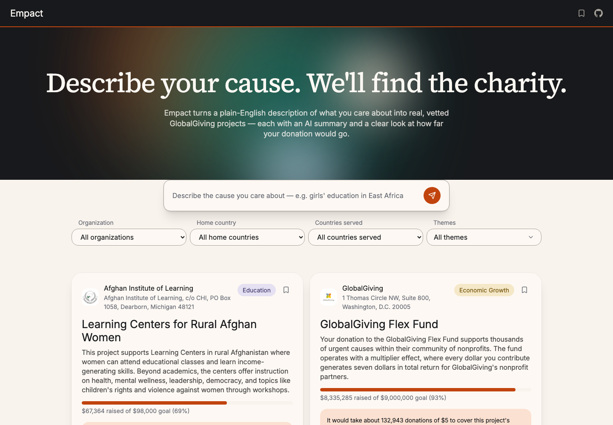

# Empact

https://empact-swart.vercel.app/

Describe a cause in plain English, get back real, vetted charity projects — not a keyword search, an actual match.

**Live demo:** 

https://asu.zoom.us/rec/share/1Liz7jUtiDITfoodd7LuyLlU0Vu3sUjlaIAeyODP8E4ekgl6jHeuHF53gwyB-k-e.DuqVLSX1kH-6m5_N?startTime=1784597290000

Passcode: w+G4.izN

## What it does

Empact turns a plain-English description of what you care about ("girls' education in East Africa," "clean water access") into semantically ranked matches against real [GlobalGiving](https://www.globalgiving.org) projects — each with an AI-generated summary, a funding-progress view, and a plain-dollar impact estimate, rather than an invented "$5 = 2 meals" style ratio.

## Features

- **Natural-language semantic search** — a query is embedded and ranked against every project in the catalog by cosine similarity, with a similarity floor that filters out noise (a one-word query or an unrelated cause returns nothing rather than a low-confidence guess)
- **Structured filters** — organization, home country, countries served, and theme, combinable with a search query
- **AI-generated project summaries** — generated once per project and cached, never regenerated on a read
- **Funding-impact estimates** — real numbers derived from each project's own funding goal and raised amount, plus a funding-velocity estimate once enough history exists
- **Similar projects** — each project page surfaces related matches by reusing the same embeddings already computed for search, at no extra API cost
- **Save projects** — a personal shortlist, stored locally, no account required
- **Direct donate links** — every project links to its real GlobalGiving page, not just the organization's homepage
- **Abuse-resistant by design** — per-IP rate limiting and strict input validation guard the paid OpenAI/Anthropic calls behind every search

## Tech stack

**Frontend:** React 19, TypeScript, Vite, Tailwind CSS v4, React Router

**Backend:** FastAPI, SQLAlchemy 2.0, PostgreSQL + [pgvector](https://github.com/pgvector/pgvector), Alembic

**AI:** OpenAI `text-embedding-3-small` for search embeddings, Anthropic Claude for project summaries

**Data source:** [GlobalGiving Project API](https://www.globalgiving.org/api/)

**Testing:** Vitest + React Testing Library, pytest

**Deployed on:** Vercel (frontend), Render (backend), Neon (database)

## Architecture

The backend is the only client of the GlobalGiving API, OpenAI, and Anthropic. It fetches and caches project data on a scheduled batch job, generates each project's embedding and summary once, and stores everything in Postgres. The frontend never talks to any of those services directly; it only calls the FastAPI backend, which keeps every API key server-side and every paid call cached rather than repeated per page view.

---

Built by [Nelson Supriyasilp](https://github.com/Nelly444)
